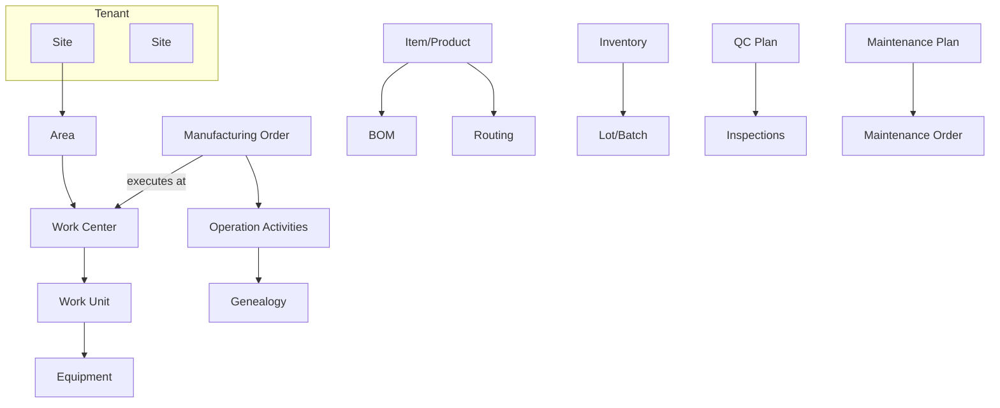
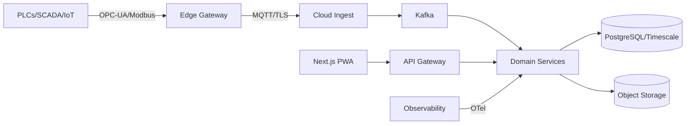

# Factory Management System — Architecture v1 (Refined)

This document refines and expands `docs/architecture.md` to remove contradictions, clarify concepts, and add depth in areas needed for implementation and go-to-market.

## 0. Principles & Scope

- **Single platform, configurable for SME → Enterprise**
- **Configure, not customize**: edition-gated modules and feature flags
- **Standards-first**: ISA-95/ISA-88, ISO 22400, GS1, OPC-UA, EDI (X12/EDIFACT)
- **Security by default**: least-privilege, encryption at rest/in transit, auditability
- **Edge-aware**: offline-first at sites, store-and-forward, secure edge connectivity
- **Modular monolith → microservices** path to manage complexity over time
- **Cloud-first with hybrid edge**; on-prem options for regulated/air-gapped plants

## 1. Access & Identity Model (Unified)

- **RBAC with fine-grained permissions**, optional **ABAC** policies
  - Roles group permissions (Operator, Supervisor, Planner, QA, Maintenance, Warehouse, Procurement, Plant Manager, IT Admin)
  - Permissions are atomic actions (e.g., `production.order.create`, `bom.edit`, `qc.inspection.approve`, `maintenance.workorder.trigger`)
  - ABAC examples: site-level restrictions, shift, skill/certification, equipment ownership
- **SSO**: OIDC/SAML with optional **SCIM** provisioning; MFA supported
- **Tenant isolation**: multi-tenant by default; per-tenant RBAC scope
  - Options: schema-per-tenant or row-level tenancy with strong RLS policies
- **Audit & e-signatures**: full audit trail; optional 21 CFR Part 11 compliant e-sign (who/what/when/why)

> Note: This replaces “PBAC vs RBAC” ambiguity with a single model: RBAC + permissions, with optional ABAC.

## 2. Canonical Domain Model & Entities (ISA-95 aligned)

- Organizational hierarchy: **Tenant → Site → Area → Work Center (Line) → Work Unit/Cell → Equipment/Asset**
- Core production:
  - **Item/Product**, **UoM**, **BOM**, **Routing**, **Operation** (resources, time stds)
  - **Production Order (ERP-level)** → decomposes into **Manufacturing Order (MES-level)** → **Operation Activities/Jobs** assigned to Work Centers
  - Clarification: Use “Production Order” for ERP/MRP entity, “Manufacturing Order (MO)” for execution in MES; “Work Order” reserved for **maintenance** tasks
- Inventory & logistics:
  - **Location**, **Bin**, **Inventory Item**, **Lot/Batch**, **Serial**, **License Plate (LP)**
  - **ASN/Shipment**, **COA/COC** attachments
- Quality:
  - **QC Plan**, **Inspection/Test**, **Sample**, **Nonconformance (NC)**, **CAPA**
- Maintenance (CMMS):
  - **Asset/Equipment**, **Maintenance Plan** (PM), **Maintenance Order/WO**, **Condition Reading**, **Spare Part**
- People & time:
  - **User**, **Role**, **Shift**, **Skill/Certification**
- Governance:
  - **Supplier**, **Purchase Order**, **Audit Log**, **Document/Attachment**, **Config Template**
- Traceability:
  - **Genealogy** linking components → subassemblies → finished goods; forward and backward trace

## 3. Architecture Overview

- **Approach**: Start with a modular monolith (clear bounded contexts) + message bus; extract hot spots into independent services as scale demands.
- **Frontend**: React/Next.js PWA, offline-aware for operator flows (local cache + conflict resolution)
- **API & Services** (initial modules):
  - Auth & Identity (SSO, RBAC, ABAC policy engine)
  - Orders & Scheduling (Production/Manufacturing Orders, dispatch, finite capacity)
  - Inventory & Traceability (locations, lots/serials, LP, genealogy)
  - BOM & Routing (templates, versioning, effectivity)
  - Quality (plans, inspections, NC/CAPA)
  - Maintenance (assets, PM schedules, predictive work)
  - Integrations (ERP, EDI, PLC/SCADA, webhooks)
- **Data stores**:
  - PostgreSQL for transactional data; TimescaleDB extension for telemetry/time-series
  - Object storage for documents/images (S3-compatible)
  - Redis for caching/queues; OpenSearch for full-text/search (optional)
- **Messaging**:
  - **MQTT** at the edge (device/gateway)
  - **Kafka** as the core service bus (events, CDC, analytics fan-out)
- **Edge Gateway**:
  - Protocol drivers (OPC-UA, Modbus), buffering (store-and-forward), compression, TLS mutual auth
  - Local rules/transformations; remote management & safe upgrades

## 4. Integrations

- **ERP**: Tiered connectors (file/CSV for SME bootstrap, REST/GraphQL, OData, and EDI X12/EDIFACT for enterprise)
  - Prebuilt adapters: SAP (IDoc/OData), Oracle, Dynamics 365 (Dataverse/OData), Netsuite
  - Patterns: async events + idempotent upserts; retries + DLQ; correlation IDs
- **PLC/SCADA/IIoT**: OPC-UA, Modbus, MQTT Sparkplug B; optional Ignition gateway integration
  - Tag naming conventions, unit normalization, out-of-order handling, time sync (NTP/PTP)
- **Suppliers/Logistics**: EDI ASN (856), PO (850), Invoices (810), DESADV/ORDERS/INVOIC for EDIFACT
- **Webhooks**: Signed, replay-protected outbound events for partners/extensibility

## 5. Non-Functional Requirements & SLOs

- **Availability (SaaS multi-tenant)**: 99.9% monthly; **Enterprise dedicated**: 99.95–99.99%
- **Performance**: p95 API latency ≤ 300 ms (SaaS), ≤ 200 ms (Enterprise); dashboard data freshness ≤ 5 s
- **Throughput**: ingest ≥ 20k events/sec/tenant (scalable via partitions); burst handling with backpressure
- **Resilience**: RPO ≤ 15 min (SaaS), ≤ 5 min (Enterprise); RTO ≤ 60 min (SaaS), ≤ 30–60 min (Enterprise)
- **Security & Compliance**:
  - ISO 27001, SOC 2, GDPR (DPA, SCCs), 21 CFR Part 11 (where applicable)
  - Encryption: TLS 1.2+, AES-256 at rest; KMS-managed keys; periodic rotation
  - Secrets management (Vault/Cloud KMS), least-privilege IAM
  - Vulnerability mgmt, patching SLAs, annual pen test, SAST/DAST
- **Data governance**: PII classification, retention by data class, data residency by region
- **Observability**: OpenTelemetry (traces/metrics/logs), SLO dashboards, alerting, runbooks

## 6. Deployment Options

- **SaaS (default)**: multi-tenant clusters per region; VPC isolation; private link options
- **Hybrid**: cloud core + on-prem Edge Gateway(s); offline ops with store-and-forward
- **On-Prem/Private Cloud**: Kubernetes or VM-based; connected or air-gapped; signed offline updates
- **Delivery**: IaC (Terraform), Helm, Argo CD/GitOps; blue/green and canary for API/UI; DB migrations (Alembic/Prisma) with safe rollbacks
- **DR**: cross-region backups/snapshots; quarterly failover tests

## 7. Data & Analytics

- **Operational analytics**: ISO 22400 KPIs, OEE, FPY, MTBF/MTTR, Inventory turns, On-time delivery
- **ML/AI (tiered)**:
  - Advanced: anomaly detection (telemetry), predictive maintenance, quality prediction, demand forecasting, schedule optimization
  - MLOps: feature store, model registry, shadow/canary, periodic retraining, drift monitoring
- **Data export**: CDC to lakehouse (e.g., Parquet/Delta) via Kafka connectors; BI-friendly schemas

## 8. Feature Tiers (Edition Gating)

| Module | Core | Advanced | Enterprise |
|---|---|---|---|
| Users, RBAC, Audit | ✓ | ✓ | ✓ |
| Sites/Work Centers/Equipment | ✓ | ✓ | ✓ |
| Manufacturing Orders, Dispatch | ✓ | ✓ | ✓ |
| BOM & Routing (basic) | ✓ | ✓ | ✓ |
| Inventory, Locations, Lots/Serials, Barcode | ✓ | ✓ | ✓ |
| Dashboards (basic KPIs) | ✓ | ✓ | ✓ |
| Mobile/PWA, Offline (operator) | ✓ | ✓ | ✓ |
| Quality: QC Plans, Inspections |  | ✓ | ✓ |
| Nonconformance, CAPA, e-sign |  | ✓ | ✓ |
| Maintenance: Assets, PM Schedules |  | ✓ | ✓ |
| Advanced Scheduling/Optimization |  |  | ✓ |
| Predictive Maintenance/AI |  |  | ✓ |
| EDI (full) & ERP deep connectors |  |  | ✓ |
| Multi-plant coordination, HA/DR |  |  | ✓ |
| SSO/SCIM, ABAC policies |  | ✓ | ✓ |

## 9. Testing & Validation

- Unit, integration, and **contract tests** for service boundaries
- E2E tests (Playwright/Cypress) for key flows: order → execution → QC → ship
- Performance and soak tests at enterprise scale
- Security testing: SAST/DAST, dependency scanning, pen tests
- UAT with pilot sites; traceability matrix to acceptance criteria

## 10. Observability & Operations

- OpenTelemetry across services; Prometheus/Grafana and Loki/ELK
- SLOs as code; alerts tied to error budgets; on-call rotation & runbooks
- Feature flags (LaunchDarkly/Unleash) for safe rollout

## 11. Glossary (to remove ambiguity)

- **Production Order (PO-ERP)**: ERP planning entity defining what to make and when
- **Manufacturing Order (MO-MES)**: Executable order in MES with assigned routing and work centers
- **Work Order (Maintenance)**: Maintenance task order (preventive/corrective/predictive)
- **Work Center**: Line/cell where operations are executed; capacity constrained
- **Lot/Batch**: Group of material with common genealogy and QC
- **License Plate (LP)**: Serialized container ID for handling/movement

## 12. Risks & Mitigations (Updated)

- **Complexity for SMEs** → Edition gating + opinionated templates + guided setup
- **Integration effort** → Connector marketplace, prebuilt adapters, sandbox + contract tests
- **Scale & data growth** → Partitioning, tiered storage, compaction policies, archiving
- **Edge connectivity** → Store-and-forward, backpressure, retry policies, DLQ, QoS 1/2
- **Security posture drift** → Automated compliance checks, CIS benchmarks, continuous scanning

## 13. Open Questions

- Data residency requirements by target markets?
- Preferred ERP targets for first connectors? (SAP S/4HANA vs D365 vs Netsuite)
- On-prem support expectations for highly regulated customers?
- Targeted languages and i18n scope for operator UIs?

## 14. Change Log

- Unified RBAC model (removed PBAC/RBAC ambiguity)
- Clarified Work Order vs Production Order terminology
- Added canonical domain model and feature tier mapping
- Added NFRs, SLOs, DR, security & compliance details
- Defined edge architecture and integration patterns
